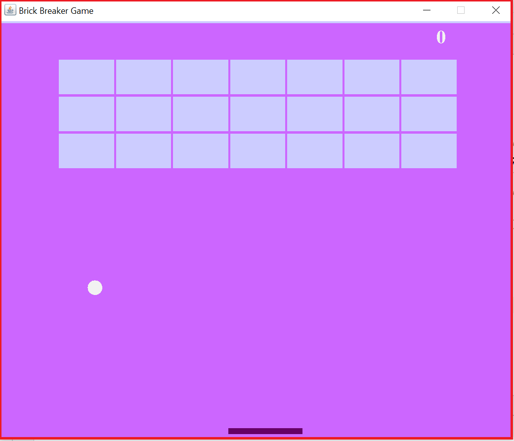

# brick-breaker-game
This program is a project of the subject IT251, Under the supervision of Dr.Mashael AL-Shuail, 4th of December 2021.

## About the Game
This program is built to create a brick-breaker game, the game contains a small ball with a specific number of bricks at the top of the window, and a slider paddle to interact with the moving ball, to win in this game you need to break all the bricks with out missing the ball.

### main.java
This file is built to create a frame to display the game inside it 

### Gameplay.java
This file defines the way the game interact with user and vice versa, also when the game starts, end, and continue.

