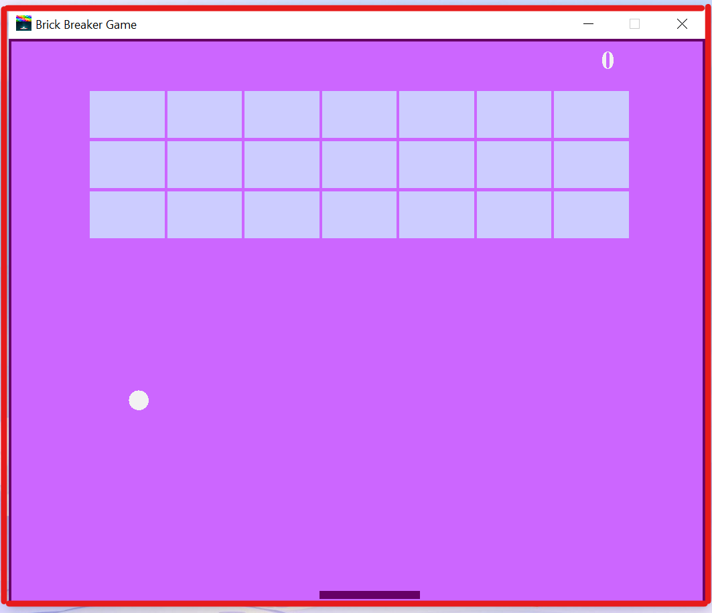

# brick-breaker-game
This program is a project of the course IT251, Under the supervision of Dr.Mashael AL-Shuail, 4th of December 2021.

## About the Game
This program is built to create a brick-breaker game, the game contains a small ball with a specific number of bricks at the top of the window, and a slider paddle to interact with the moving ball, to win this game you need to break all the bricks without missing the ball.

### Main.java

This file is built to create a window to display the game inside it "The red rectangle illustrate the frame window". <br/><br/>



### Gameplay.java

This file defines the interactions between the user and the game, the style of the components of the game, specifies when the game starts, ends and continues.<br/> Also: <br/>

>What happens if the user wins
```java
//YOU WON! if the number of bricks are done
        if(totalBricks <= 0){
            play = false;
            ballXdir = 0;
            ballYdir = 0;
            //the style of the wining phrase
            g.setColor(new Color(102, 0, 102));
            g.setFont(new Font("serif", Font.BOLD, 30));
            g.drawString("YOU WON !, SCORE:"+score, 180, 300);

            g.setFont(new Font("serif", Font.BOLD, 20));
            g.drawString("Press 'Enter' to restart", 230, 350);
        }
``` 


> What happens if the user loses
```java
//GAME OVER "if the ball went down"
        if(ballposY > 570){
            play = false;
            ballXdir = 0;
            ballYdir = 0;
            //the style of the losing phrase
            g.setColor(new Color(102, 0, 102));
            g.setFont(new Font("serif", Font.BOLD, 30));
            g.drawString("GAME OVER, SCORE:" + score, 180, 300);

            g.setFont(new Font("serif", Font.BOLD, 20));
            g.drawString("Press 'Enter' to restart", 230, 350);
        }
```


### MapGenerator.java
This file creates the bricks and styles them.


